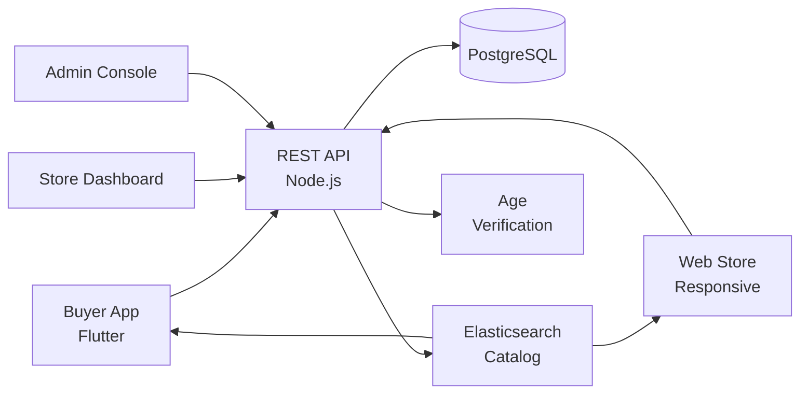

# Vivino Clone — White-Label Alcohol & Beverage E-Commerce Platform by Miracuves

**MXAzon** is a production-ready, white-label Vivino clone: a complete alcohol & beverage e-commerce platform with age verification and admin console — delivered with **100% source code ownership** in **6 working days**.

> 🍷 **See it running before you talk to anyone.** Live buyer app, store dashboard, and admin console — demo credentials are printed on the [solution page](https://miracuves.com/vivino-clone#demo). No sales call required.

---

## 🚀 Live Demos

| Environment | URL | What you can test |
|---|---|---|
| 📱 Buyer App | [mas.mimeld.com](https://mas.mimeld.com) | Browse, age-verify, order, track delivery |
| 🌐 Web Store | [mxazon.mimeld.com](https://mxazon.mimeld.com) | Full wine/spirits e-commerce in browser |
| 🍾 Store Dashboard | [Solution page → Demo](https://miracuves.com/vivino-clone#demo) | Inventory, orders, compliance, analytics |
| 🛠️ Admin Console | [Solution page → Demo](https://miracuves.com/vivino-clone#demo) | Stores, regions, age checks, analytics |

Demo credentials for all environments: **[miracuves.com/vivino-clone → Demo section](https://miracuves.com/vivino-clone/#demo)**

---

## ✨ What Makes This Vivino Clone Different

Most alcohol-delivery scripts stop at "catalog + checkout." This platform ships with the features that actually run an alcohol-e-commerce *business*:

- **Age Verification Built-In** — ID + selfie + age gate at checkout + delivery — required to sell alcohol online legally
- **Sommelier-Grade Catalog** — 
- **Same-Day Delivery with ID Check** — varietal, region, vintage, pairing, ratings — same depth Vivino and Drizly built for wine/spirits
- **Subscription Cases** — state-by-state rules for hours, IDs, deliveries — same logic every alcohol e-commerce needs
- **Regional Compliance Rules** — monthly curated wine/spirits cases — what drives Drizly, Flaviar, and Winc's LTV

## 📦 Core Features

**Buyer:** age verification · browse catalog · wine/spirits education · taste profile · cart with delivery window · live tracking · reviews

**Store / Vendor:** inventory · orders · age-checked delivery · compliance reports · payouts · analytics

**Admin:** regional rules · age verification · store approvals · commission engine · analytics

## 🏗️ Architecture

**Stack:** Flutter mobile apps · Node.js backend · Elasticsearch for catalog · PostgreSQL · Stripe · ID-verification provider · Stripe, regional gateways, ID-verification add-on

## 📋 What’s Included

- ✅ Full source code — backend, web, mobile apps, panels (no encryption, no license locks)
- ✅ Deployment to your servers & app store submission assistance
- ✅ Your branding — white-label rename, logo, colors, domain
- ✅ 60 days post-launch support + 12 months of free updates
- ✅ Documentation & handover

**Pricing:** from **$2,899**, transparent on the [solution page](https://miracuves.com/vivino-clone/#pricing) — no "contact us for quote" games.

## 🆚 Why Not Build From Scratch?

Custom alcohol-delivery platforms run $80k–$300k and 5–10 months. A proven white-label base gets you to market in 6 working days for a fraction of that, with your budget preserved for compliance and courier ID checks.

## 📚 Resources

- 📖 [Vivino Clone — Full Solution Page](https://miracuves.com/vivino-clone) (features, pricing, demos, FAQ)
- 💰 [How Much Does an Alcohol E-Commerce App Cost in 2026?](https://miracuves.com/vivino-clone#pricing) pricing breakdown & what's included
- 📝 [Best Vivino Clone Script in 2026](https://miracuves.com/vivino-clone/blog/) features, pricing & launch guide
- 🧠 [Regional Alcohol Delivery Compliance](https://miracuves.com/vivino-clone/blog/) state-by-state rule map
- ✅ [Miracuves Facts & Claims Ledger](https://miracuves.com/vivino-clone/facts/) every claim we make, verified

## 🏢 About Miracuves

[Miracuves Solutions](https://miracuves.com) builds white-label clone apps and custom software from Mumbai, India — 90+ ready-made solutions, live demos for every product, transparent pricing, and delivery in 6 working days. Operating since 2010.

**Talk to us:** [WhatsApp](https://wa.me/919830009649) · [Schedule a consultation](https://miracuves.com/schedule-consultation/) · [miracuves.com](https://miracuves.com)

---

### ⚠️ Note on This Repository

This repository is a product overview. The full source code is delivered to clients on purchase — see [what’s included](https://miracuves.com/vivino-clone/#included). For a hands-on evaluation, use the live demos above; credentials are public on the solution page.

*Keywords: vivino clone, vivino clone script, alcohol delivery, wine app, spirits e-commerce, white label Drizly, ID verification, Flutter, Node.js*

---

<!--
══════════════════════════════════════════════════
TEMPLATE VARIABLE KEY — auto-generated from Netflix-Clone pattern
══════════════════════════════════════════════════
{APP_NAME}        Vivino Clone
{MX_NAME}         MXAzon
{CATEGORY}        Alcohol & Beverage E-Commerce Platform
{DEMO_WEB}        mxazon.mimeld.com
{PRICE}           $2,899
{SLUG}            vivino-clone
{SOLUTION_URL}    https://miracuves.com/vivino-clone/
{VERTICAL}        alcohol

See /tmp/verticals/alcohol.txt for the vertical config used to generate this README.
══════════════════════════════════════════════════
-->